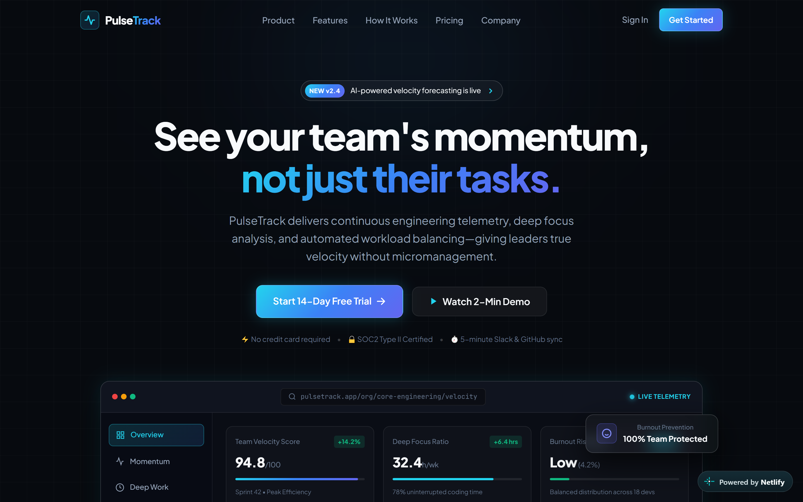
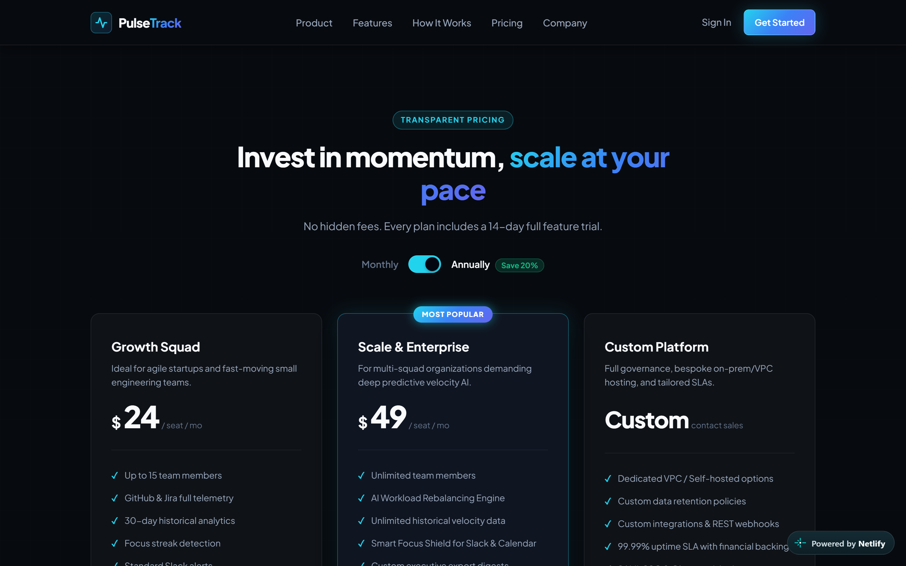
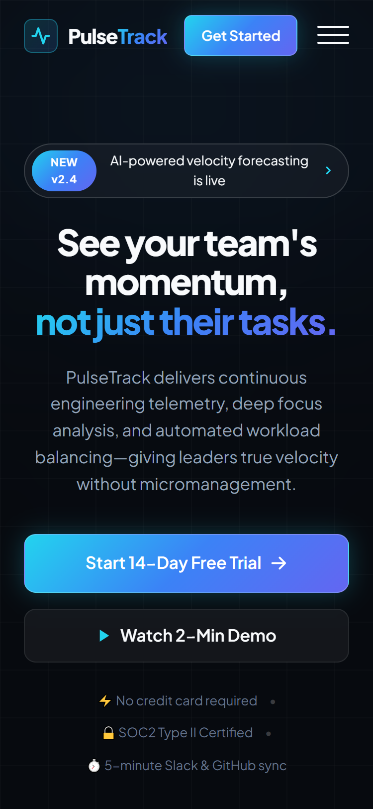

# PulseTrack — Team Productivity & Analytics SaaS Landing Page

> **Auspify Technologies Internship — Task 1 (Responsive Landing Page)**

A dark-themed, glassmorphic SaaS landing page built for **PulseTrack**, a fictional team productivity and analytics platform. Designed to look and feel like a real high-growth startup's marketing site — inspired by the visual language of products like Linear, Vercel, and Raycast.

   

## Live Demo
[pulsetrack-frontend.netlify.app](https://pulsetrack-frontend.netlify.app)

##  Features

- Fully responsive dark-themed hero section with a custom CSS/SVG mock dashboard preview (no static screenshots)
- Glassmorphism UI — translucent cards, backdrop blur, subtle glow borders
- Sticky navbar with scroll-aware blur/saturation effect and mobile hamburger drawer
- Interactive Monthly / Annual pricing toggle with live price updates
- Scroll-reveal animations powered by `IntersectionObserver`
- Feature grid, stats strip, "How It Works" flow, testimonial section, and final CTA banner
- Zero external framework dependencies — pure HTML5, CSS3, and vanilla JavaScript

## Screenshots

### Desktop


### Key Feature


### Mobile


## Design System

| Token | Value |
|---|---|
| Background | `#070A0F` |
| Accent Gradient | `#22D3EE` → `#3B82F6` → `#6366F1` |
| Headline Font | Plus Jakarta Sans |
| Mono / Detail Font | JetBrains Mono |

## Project Structure

```
PulseTrack/
├── index.html    # Semantic HTML5 markup
├── style.css     # Design system, glassmorphism, responsive layout, animations
└── script.js     # Mobile menu, scroll effects, pricing toggle, scroll-reveal
```

## Running Locally

No build step or dependencies required.

```bash
# Option 1 — Python
python -m http.server 3000

# Option 2 — Node
npx serve .
```

Then open `http://localhost:3000` in your browser.

> Avoid opening `index.html` directly via `file://` — some browsers restrict anchor-link navigation and JS behavior under the file protocol. Always serve it locally.

## Responsive Breakpoints

Tested at 1440px (desktop), 1024px, 768px (tablet), and 375px (mobile).

## Built With

- HTML5
- CSS3 (Grid, Flexbox, custom properties, `backdrop-filter`)
- Vanilla JavaScript (`IntersectionObserver`, event delegation)

---

**Part of a 4-project internship submission for Auspify Technologies.**
See also: [Flowboard](https://github.com/fahadmusa725/flowboard-task-manager) · [Skyline](https://github.com/fahadmusa725/skyline-weather-dashboard) · [Cadence](https://github.com/fahadmusa725/cadence-ecommerce-store)
